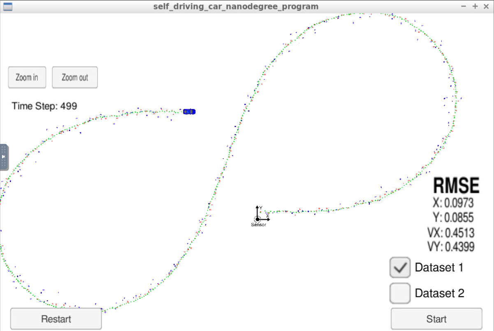
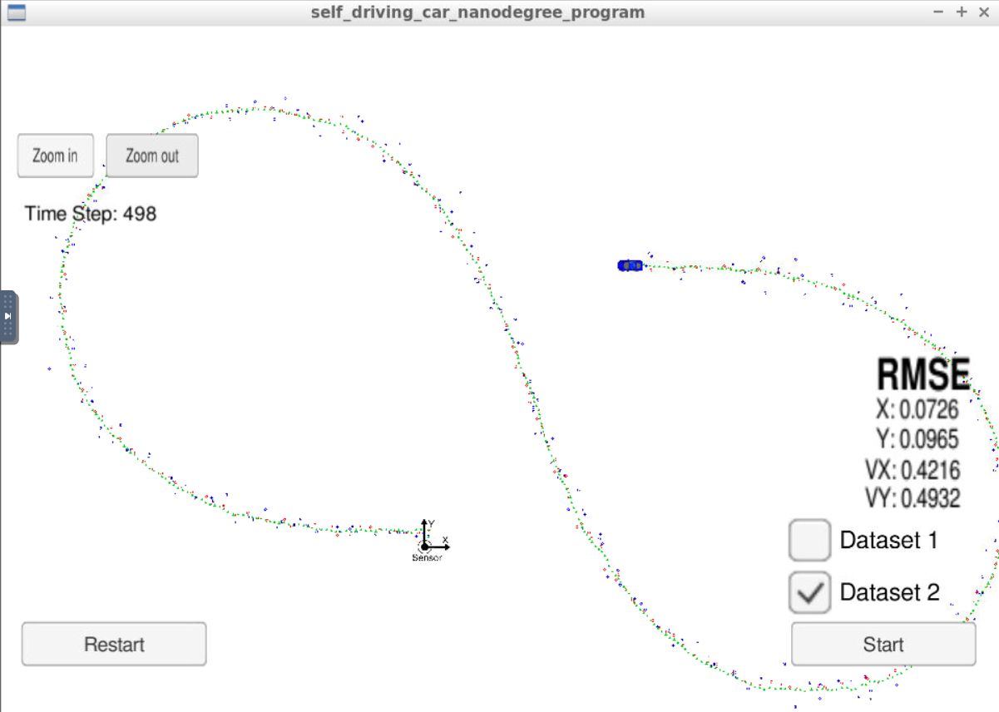
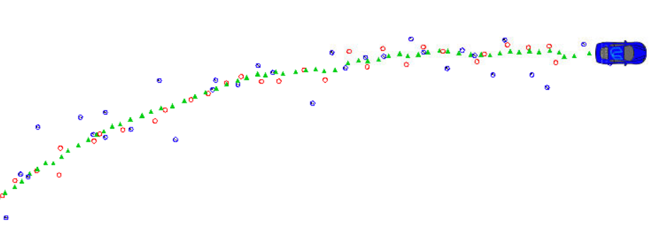

# Self-Driving Car Engineer Nanodegree

## Project: **Extended Kalman Filter** 

The goals / steps of this project are the following:
* Implementing Kalman filter for lidar measurements
* Implementing Extended Kalman filter for radar measurements
* Implementing sensor fusion of both lidar and radar measurements
* Implementing accuracy evaluation method for the sensor fusion

Rubric: [link](https://review.udacity.com/#!/rubrics/748/view)

Udacity repository: [link](https://github.com/udacity/CarND-Extended-Kalman-Filter-Project)

Simulator: [link](https://github.com/udacity/self-driving-car-sim/releases)

### Project details

This repository designed to work with the simulator. The input data consists of lidar(position) and radar(radius, angle, radial velocity) measurements. The required output is the estimated position of the simulated car and the accuracy of the estimation (RMSE). The position estimation is based on a simplified motion model (no acceleration).

Detailed description of dependencies in Udacity repository.

### Results

Red circle: input data, measured position by lidar
Blue circle: input data, measured position by radar (angle represented by a marker)
Green triangle: output of Kalman filter, estimated position of car

